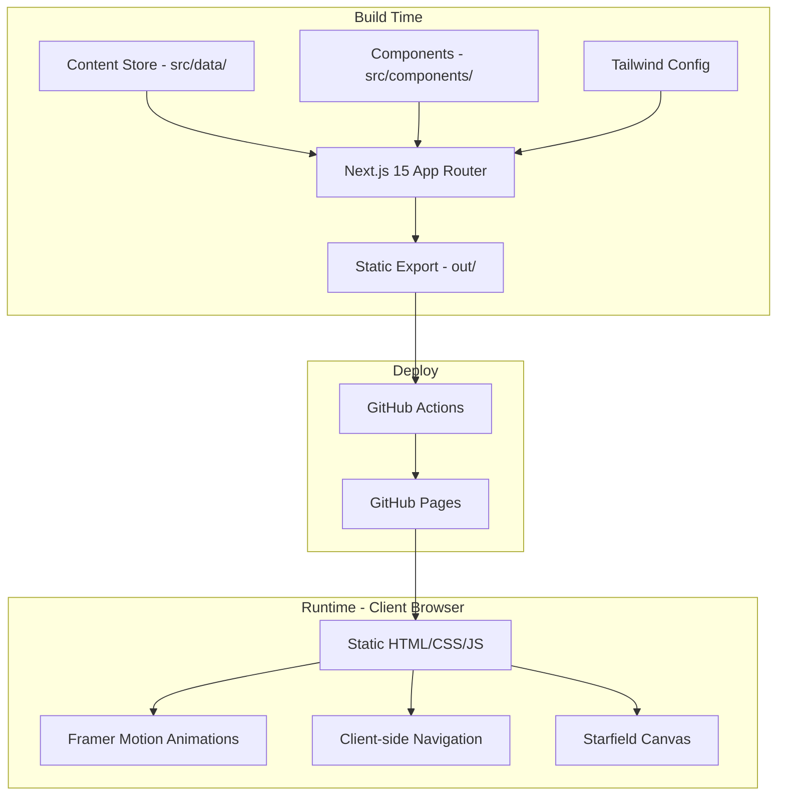
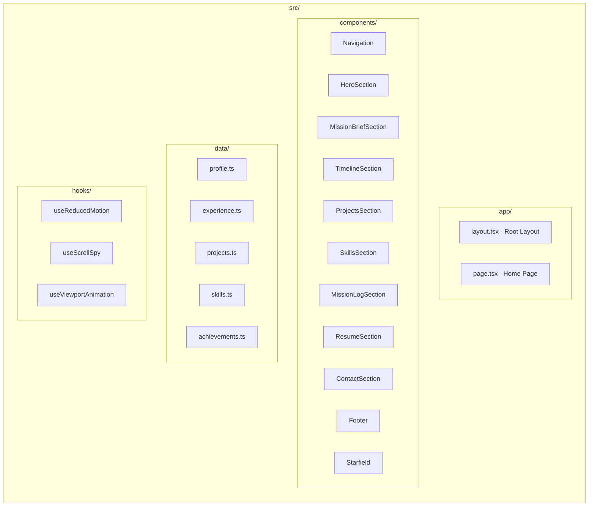
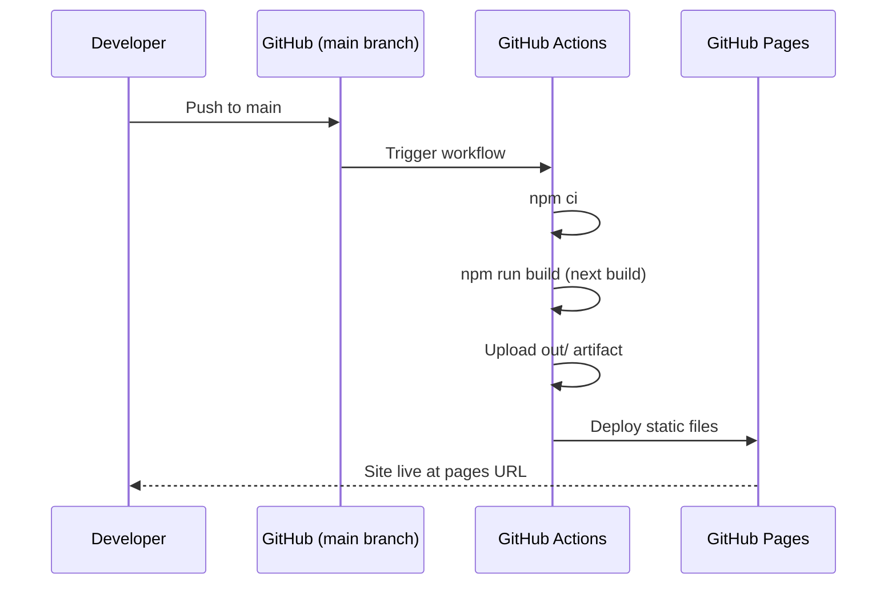

# Design Document

## Overview

This design describes a modern, space-themed personal portfolio website for Pavan Koundinya built as a fully static Next.js 15+ application. The site uses a Mission Control visual metaphor — drawing from satellite operations consoles and deep space exploration interfaces — to present professional experience, projects, skills, and achievements.

The application is a single-page layout with smooth-scroll navigation between sections. All content is driven from centralized TypeScript data files, enabling content updates without component modifications. The site is exported as static HTML/CSS/JS and deployed to GitHub Pages via a GitHub Actions workflow.

**Key Technical Decisions:**
- **Next.js 15+ App Router with static export** — Provides modern React features (Server Components for build-time rendering, file-based routing) while outputting pure static files via `output: 'export'`
- **Tailwind CSS v3+** — Utility-first CSS with custom theme configuration for the Mission Control color palette
- **Framer Motion v11+** — Declarative animation library with built-in viewport detection, `useReducedMotion` hook, and performant spring/tween animations
- **Single-page architecture** — All sections on one page with hash-based navigation, avoiding dynamic routing complexity for static deployment

## Architecture

### High-Level Architecture



### Application Architecture



### Rendering Strategy

The application uses Next.js static export (`output: 'export'` in `next.config.mjs`). At build time, all pages are pre-rendered to HTML. At runtime, React hydrates the page and Framer Motion handles animations client-side. There are no API routes, no server-side rendering at request time, and no database connections.

### Deployment Pipeline



## Components and Interfaces

### Component Hierarchy

```
RootLayout (app/layout.tsx)
├── Starfield (fixed background, z-0)
├── Navigation (fixed top, z-50)
├── main
│   ├── HeroSection
│   ├── MissionBriefSection
│   ├── TimelineSection
│   ├── ProjectsSection
│   ├── SkillsSection
│   ├── MissionLogSection
│   ├── ResumeSection
│   └── ContactSection
└── Footer
```

### Component Specifications

#### Starfield

| Aspect | Detail |
|--------|--------|
| Rendering | HTML5 Canvas with `requestAnimationFrame` loop |
| Layers | 2 depth layers: far stars (slow parallax, small size) and near stars (faster parallax, larger size) |
| Star count | 50–200 stars total, distributed across layers |
| Performance | Canvas renders at device pixel ratio; throttled to 30fps minimum; pauses when tab is hidden via `document.hidden` |
| Reduced motion | Static star positions, no animation loop |
| Position | `position: fixed; inset: 0; z-index: 0` behind all content |

```typescript
interface StarfieldProps {
  starCount?: number; // default 150
  className?: string;
}
```

#### Navigation

| Aspect | Detail |
|--------|--------|
| Layout | Fixed top bar, full width, semi-transparent dark background with backdrop blur |
| Desktop (≥1024px) | Horizontal link list |
| Mobile (<1024px) | Hamburger icon toggles slide-down menu |
| Active detection | Intersection Observer on each section; highlights current section link |
| Scroll behavior | `scrollIntoView({ behavior: 'smooth' })` on link click |

```typescript
interface NavItem {
  label: string;
  href: string; // e.g., "#mission-brief"
}
```

#### HeroSection

| Aspect | Detail |
|--------|--------|
| Height | `min-h-screen` (100vh) |
| Content | h1 name, subtitle, tagline, two CTA buttons, social icons |
| Animation | Staggered fade-in via Framer Motion `staggerChildren` (total ≤1500ms) |
| Satellite | CSS/SVG wireframe with `@keyframes float` animation (gentle Y-axis oscillation) |
| Reduced motion | All elements visible immediately, no stagger, satellite static |

#### MissionBriefSection

| Aspect | Detail |
|--------|--------|
| Layout | 4 expertise cards in a 2×2 grid (desktop) or single column (mobile) |
| Stats | Years of experience, current role, domain expertise list |
| Animation | Cards fade in on viewport entry |
| Data source | `profile.ts` |

#### TimelineSection

| Aspect | Detail |
|--------|--------|
| Layout | Vertical timeline with center line (desktop) or left-aligned line (mobile) |
| Entries | Alternating left/right on desktop; all left-aligned on mobile |
| Current role | Distinguished with "Current" badge and accent border |
| Rocket icon | SVG positioned on timeline axis, CSS animated to progress position |
| Animation | Each entry fades in + slides horizontally on viewport entry (≤500ms) |
| Data source | `experience.ts` |

#### ProjectsSection

| Aspect | Detail |
|--------|--------|
| Grid | 1 col (<768px), 2 cols (768–1023px), 3 cols (≥1024px) |
| Featured | `col-span-2` at ≥1024px, sorted before non-featured |
| Card content | Name, description, tech tags, impact statement, optional links |
| Hover | Scale transform + elevated shadow (150–300ms transition) |
| Data source | `projects.ts` |

#### SkillsSection

| Aspect | Detail |
|--------|--------|
| Categories | Backend Systems, Cloud & Infrastructure, Databases, Frontend, Soft Skills |
| Interaction | Hover (desktop) or tap (mobile) reveals proficiency percentage |
| Animation | Fade-in on viewport entry (≤800ms) |
| Data source | `skills.ts` |

#### MissionLogSection

| Aspect | Detail |
|--------|--------|
| Style | Terminal/monospace aesthetic with bordered panels |
| Records | Mission ID, description, category label |
| Animation | Sequential fade-in with 150–300ms stagger |
| Empty state | Placeholder message when no data |
| Data source | `achievements.ts` |

#### ResumeSection

| Aspect | Detail |
|--------|--------|
| Content | Professional summary (≤300 chars), download button |
| Download | `<a href="/resume.pdf" download>` with accessible label |
| Error state | Message shown if PDF unavailable (checked via fetch HEAD or onError) |
| Data source | `profile.ts` (summary text) |

#### ContactSection

| Aspect | Detail |
|--------|--------|
| Fields | Name (max 100), Email (max 254), Message (max 2000) |
| Validation | Client-side: required check + email regex; errors shown per-field |
| Submission | Formspree POST or mailto fallback |
| States | idle, submitting, success, error |
| Error handling | Preserves form data on failure, shows error message |
| Social links | GitHub, LinkedIn, Email |

#### Footer

| Aspect | Detail |
|--------|--------|
| Content | Name, title, "Built with Next.js", copyright year, social links |
| Year | Computed at build time or via `new Date().getFullYear()` |
| Links | Open in new tab (`target="_blank" rel="noopener noreferrer"`) |

### Custom Hooks

#### `useScrollSpy`

Monitors which section is currently in the viewport using Intersection Observer. Returns the active section ID for navigation highlighting.

```typescript
function useScrollSpy(sectionIds: string[], options?: IntersectionObserverInit): string | null;
```

#### `useReducedMotion`

Wraps `window.matchMedia('(prefers-reduced-motion: reduce)')` to provide a reactive boolean.

```typescript
function useReducedMotion(): boolean;
```

#### `useViewportAnimation`

Returns Framer Motion animation props that respect reduced motion preferences. Provides consistent fade-in behavior across sections.

```typescript
function useViewportAnimation(options?: {
  delay?: number;
  duration?: number;
  direction?: 'up' | 'left' | 'right';
}): {
  ref: React.RefObject<HTMLElement>;
  initial: object;
  animate: object;
  transition: object;
};
```

## Data Models

### Content Store Interfaces

#### profile.ts

```typescript
export interface Profile {
  name: string;
  title: string;
  tagline: string;
  summary: string; // ≤300 characters
  yearsOfExperience: number;
  currentRole: {
    title: string;
    company: string;
  };
  domainExpertise: string[];
  expertiseCards: ExpertiseCard[];
  socialLinks: SocialLink[];
}

export interface ExpertiseCard {
  title: string;
  description: string;
}

export interface SocialLink {
  platform: 'github' | 'linkedin' | 'email';
  url: string;
  label: string; // accessible label
}
```

#### experience.ts

```typescript
export interface ExperienceEntry {
  id: string;
  company: string;
  role: string;
  startDate: string; // "MMM YYYY" format
  endDate: string | null; // null = current
  isCurrent: boolean;
  description: string;
  achievements?: string[];
}

export type ExperienceData = ExperienceEntry[];
```

#### projects.ts

```typescript
export interface Project {
  id: string;
  name: string;
  description: string;
  technologies: string[];
  impact: string;
  featured: boolean;
  githubUrl?: string;
  demoUrl?: string;
}

export type ProjectsData = Project[];
```

#### skills.ts

```typescript
export interface Skill {
  name: string;
  proficiency: number; // 0–100
}

export interface SkillCategory {
  category: string; // e.g., "Backend Systems"
  skills: Skill[];
}

export type SkillsData = SkillCategory[];
```

#### achievements.ts

```typescript
export interface Achievement {
  id: string; // mission identifier, e.g., "MSN-001"
  description: string;
  category: string;
}

export type AchievementsData = Achievement[];
```

### Configuration Files

#### next.config.mjs

```javascript
/** @type {import('next').NextConfig} */
const nextConfig = {
  output: 'export',
  images: {
    unoptimized: true, // Required for static export
  },
  basePath: process.env.NEXT_PUBLIC_BASE_PATH || 'https://pavankoundinya-47.github.io/portfolio',
  assetPrefix: process.env.NEXT_PUBLIC_BASE_PATH || 'https://pavankoundinya-47.github.io/portfolio',
};

export default nextConfig;
```

#### tailwind.config.ts

```typescript
import type { Config } from 'tailwindcss';

const config: Config = {
  content: ['./src/**/*.{ts,tsx}'],
  theme: {
    extend: {
      colors: {
        'space-bg': '#020617',
        'space-surface': '#0F172A',
        'space-accent': '#3B82F6',
        'space-accent-secondary': '#8B5CF6',
        'space-text': '#E2E8F0',
        'space-muted': '#94A3B8',
        'space-success': '#10B981',
      },
      fontFamily: {
        sans: ['Inter', 'system-ui', 'sans-serif'],
        mono: ['JetBrains Mono', 'Fira Code', 'monospace'],
      },
      animation: {
        'float': 'float 6s ease-in-out infinite',
        'twinkle': 'twinkle 3s ease-in-out infinite',
      },
      keyframes: {
        float: {
          '0%, 100%': { transform: 'translateY(0px)' },
          '50%': { transform: 'translateY(-10px)' },
        },
        twinkle: {
          '0%, 100%': { opacity: '1' },
          '50%': { opacity: '0.3' },
        },
      },
    },
  },
  plugins: [],
};

export default config;
```

## Correctness Properties

*A property is a characteristic or behavior that should hold true across all valid executions of a system — essentially, a formal statement about what the system should do. Properties serve as the bridge between human-readable specifications and machine-verifiable correctness guarantees.*

### Property 1: Starfield generates correct star count

*For any* starCount value between 50 and 200 (inclusive), the Starfield star generation function SHALL produce exactly that many star objects distributed across its depth layers.

**Validates: Requirements 4.1**

### Property 2: Scroll spy identifies active section

*For any* set of section DOM elements with known vertical positions and any scroll offset, the scroll spy hook SHALL return the ID of the section whose top boundary is closest to (but not below) the current viewport top, or null if no section is in view.

**Validates: Requirements 5.8**

### Property 3: Timeline entries are reverse chronologically ordered

*For any* list of ExperienceEntry objects with valid date strings, the timeline rendering logic SHALL output entries sorted by start date in descending order (most recent first).

**Validates: Requirements 8.1**

### Property 4: Project cards display all required fields

*For any* valid Project object, the rendered project card SHALL contain the project name, description, at least one technology tag, and the impact statement.

**Validates: Requirements 9.2**

### Property 5: Project cards conditionally render links

*For any* Project object, if `githubUrl` is defined then a GitHub link SHALL be rendered, and if `demoUrl` is defined then a demo link SHALL be rendered. If neither is defined, no external links SHALL appear on the card.

**Validates: Requirements 9.3**

### Property 6: Featured projects appear before non-featured

*For any* list of Project objects containing both featured and non-featured items, all featured projects SHALL appear before all non-featured projects in the rendered grid order.

**Validates: Requirements 9.4**

### Property 7: Skills are grouped by category

*For any* SkillsData array, each category SHALL be rendered as a distinct visual group with its category label, and every skill within that category SHALL appear inside that group.

**Validates: Requirements 10.1**

### Property 8: Skill proficiency displays correct value

*For any* Skill object with a proficiency value p where 0 ≤ p ≤ 100, the hover/tap interaction SHALL display exactly the value p as a percentage.

**Validates: Requirements 10.3**

### Property 9: Achievement records display all fields

*For any* Achievement object, the rendered mission log record SHALL display the mission identifier (id), description, and category label.

**Validates: Requirements 11.1**

### Property 10: Contact form validates empty required fields

*For any* combination of form field values where at least one required field (Name, Email, or Message) is empty or whitespace-only, form submission SHALL be prevented and a validation error message SHALL appear adjacent to each empty/invalid field.

**Validates: Requirements 13.4**

### Property 11: Contact form validates email format

*For any* string in the Email field that does not match a valid email pattern (containing @ with valid local and domain parts), form submission SHALL display an email format validation error adjacent to the Email field.

**Validates: Requirements 13.5**

### Property 12: Heading hierarchy is valid

*For any* rendered page state, there SHALL be exactly one h1 element, and heading levels SHALL not skip (e.g., an h2 SHALL not be followed by an h4 without an intervening h3).

**Validates: Requirements 16.3**

### Property 13: Reduced motion disables non-essential animations

*For any* animated component, when the `prefers-reduced-motion: reduce` media query is active, the component SHALL render in its final visual state without motion transitions or animation loops.

**Validates: Requirements 16.7, 20.6**

### Property 14: No animation exceeds maximum duration

*For any* Framer Motion animation configuration in the application, the specified duration SHALL not exceed 1000 milliseconds.

**Validates: Requirements 20.4**

## Error Handling

### Form Submission Errors

| Scenario | Behavior |
|----------|----------|
| Empty required field | Inline error message per field; form not submitted |
| Invalid email format | Inline error on email field; form not submitted |
| Service error (Formspree/network) | Toast or inline error message; form data preserved in state |
| Successful submission | Success confirmation message; form fields cleared |

### Resume Download Errors

| Scenario | Behavior |
|----------|----------|
| PDF file missing (404) | Display "Resume currently unavailable" message in place of download button |
| Network error | Browser handles natively (download attribute with static file) |

### Content Store Errors

Since all content is loaded at build time from TypeScript files, runtime content errors are not possible in production. TypeScript compilation catches missing or malformed data at build time. If a Content_Store file has invalid data, the build fails (Requirement 1.7).

### Empty State Handling

| Component | Empty State |
|-----------|-------------|
| MissionLogSection | "No mission records available" placeholder |
| ProjectsSection | Not applicable (minimum content guaranteed by Content_Store) |
| SkillsSection | Not applicable (minimum content guaranteed by Content_Store) |

### Animation Error Handling

- Framer Motion gracefully degrades if animations fail — content remains visible in final state
- Canvas errors in Starfield: catch and render static star positions as fallback
- `prefers-reduced-motion` respected globally via `useReducedMotion` hook

## Testing Strategy

### Unit Tests (Vitest + React Testing Library)

Unit tests verify specific component behavior with concrete examples:

- **Navigation**: Renders all links, hamburger toggles on mobile, active link highlighting
- **HeroSection**: Renders h1 with name, CTA buttons have correct hrefs, social links open in new tab
- **MissionBriefSection**: Renders exactly 4 expertise cards, displays stats
- **TimelineSection**: Renders "Current" badge on current role, rocket icon present
- **ProjectsSection**: Featured cards have col-span-2 class, links render conditionally
- **SkillsSection**: Categories render with labels, proficiency shows on interaction
- **MissionLogSection**: Monospace font applied, empty state renders placeholder
- **ResumeSection**: Download button has correct href and download attribute
- **ContactSection**: Validation errors appear for empty fields, success/error states
- **Footer**: Copyright year is current, social links have target="_blank"
- **Accessibility**: Semantic elements present, aria-labels on icon buttons, heading hierarchy

### Property-Based Tests (fast-check + Vitest)

Property-based tests use [fast-check](https://github.com/dubzzz/fast-check) to verify universal properties across randomly generated inputs. Each property test runs a minimum of 100 iterations.

| Property | Test Approach |
|----------|--------------|
| P1: Star count | Generate random starCount 50-200, verify array length |
| P2: Scroll spy | Generate random section positions + scroll offset, verify correct section returned |
| P3: Timeline order | Generate random ExperienceEntry arrays, verify descending date sort |
| P4: Project card fields | Generate random Project objects, verify all fields rendered |
| P5: Conditional links | Generate Projects with/without URLs, verify link presence matches data |
| P6: Featured ordering | Generate mixed featured/non-featured lists, verify featured come first |
| P7: Skills grouping | Generate random SkillsData, verify category grouping |
| P8: Proficiency display | Generate random proficiency 0-100, verify displayed value |
| P9: Achievement fields | Generate random Achievement objects, verify all fields rendered |
| P10: Empty field validation | Generate form states with random empty fields, verify errors |
| P11: Email validation | Generate invalid email strings, verify error shown |
| P12: Heading hierarchy | Render page, verify h1 count and heading order |
| P13: Reduced motion | Render with reduced motion, verify no animation props active |
| P14: Animation duration | Collect all animation configs, verify all ≤1000ms |

**Test tag format:** `Feature: portfolio-website, Property {N}: {title}`

### Integration Tests

- **Build verification**: `npm run build` produces `out/` directory without errors
- **Static serving**: Serve `out/` and verify all navigation links resolve
- **Asset paths**: Verify all assets load correctly with configured base path
- **Lighthouse CI**: Automated performance score check (≥90)

### Accessibility Testing

- **axe-core**: Automated accessibility audit in unit tests
- **Manual testing**: Keyboard navigation, screen reader verification (requires human review)
- **Contrast verification**: Automated check of color palette against WCAG 2.1 AA ratios

### Test Configuration

```typescript
// vitest.config.ts
import { defineConfig } from 'vitest/config';
import react from '@vitejs/plugin-react';

export default defineConfig({
  plugins: [react()],
  test: {
    environment: 'jsdom',
    setupFiles: ['./src/test/setup.ts'],
    globals: true,
  },
});
```

**Dependencies:**
- `vitest` — test runner
- `@testing-library/react` — component testing
- `@testing-library/jest-dom` — DOM matchers
- `fast-check` — property-based testing (minimum 100 iterations per property)
- `jsdom` — DOM environment for unit tests

